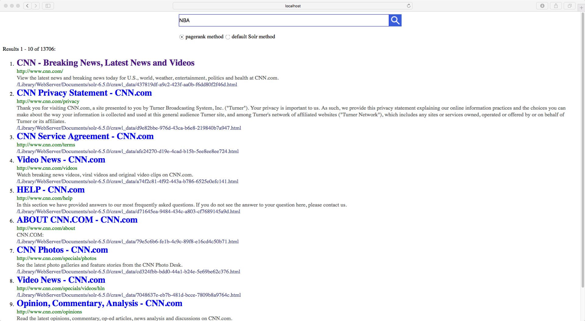

# Solr Search Engine
> You are able to design your own search engine use my project!


It is a self-designed search engine built on Apache Solr and Crawler4j. You can decide the files to be indexed and the algorithm for ranking.



## Download

```
$ git clone https://github.com/jiayilai/SearchEngine.git
```

## Configuration Instruction

1. Download Apache Solr 6.5.0.
2. Install Solr through terminal (MAC). 
	[More installation tutorial](http://lucene.apache.org/solr/quickstart.html)
3. Cd into solr-6.5.0 folder. Start Solr using command ```bin/solr```.
	Start and create a new core named as myexample using command ```$ bin/solr create –c myexample```.
4. Put all the crawled html webpages from Crawler4j into the folder named **solr-6.5.0/crawl_data**.
5. Using TIKA to index html files inherently. Index the html files using command
	```
	$ bin/post –c myexample –filetypes html crawl_data/
	```
6. Open the Solr UI and double check if the filed get indexed. Open the browser and go to <http://localhost:8983/solr/> . Select the core “myexample” from the dropdown and see the statics.
7. Download outgoing links extractor IDEA java project and run it to get Edgelist.txt, which is located in ***OutlinkExtractor_path/src/main/resources/Edgelist.txt***, using command
	```$ git clone https://github.com/jiayilai/OutlinkExtractor.git
	```
	Modify the file path for crawl_data which is in c=solr-6.5.0 and crawler map file generated by crawler4j. The following is example:

	```java
	private final static String dirPath = "/Library/WebServer/Documents/solr-6.5.0/crawl_data"; 
	private final static String edgeListPath = "src/main/resources/Edgelist.txt";
	private final static String mapFilePath = "src/main/resources/mapCNNDataFile.csv";
	```
8. Download and install networkX. (Update python to 3.6.1.)

   [Download tutorial](https://networkx.github.io/documentation/networkx-1.10/download.html)
	[Install tutorial](https://networkx.github.io/documentation/networkx-1.10/install.html)
9. Download Pycharm python project, pagerank, which is used to generate pagerank file by command
	```$ git clone https://github.com/jiayilai/pagerank.git
	```
Modify path string constant for Edgelist.txt and crawl_data as following example. Run and generate ***external_pageRankFile.txt***
	
	```	python
	base = "/Library/WebServer/Documents/solr-6.5.0/crawl_data/"
	edgelistPath="/Users/laijiayi/IdeaProjects/hw4_572/src/main/resources/Edgelist.txt"
	```

10. Place external_pageRankFile.txt in ***solr-6.5.0/server/solr/myexample/data*** folder inside the core folder.

11. Add the following to ***solr-6.5.0/server/solr/myexample/conf/managed-schema***

	```xml
	<fieldType name="external" keyField="id" defVal="0" class="solr.ExternalFileField" valType="float"/>
	<field name="pageRankFile" type="external" stored="false" indexed="false"/>
	```
12. Modify ***solr-6.5.0/server/solr/myexample/conf/solrconfig.xml*** adding:
	
	```xml
	<listener event="newSearcher" class="org.apache.solr.schema.ExternalFileFieldReloader"/>
	<listener event="firstSearcher" class="org.apache.solr.schema.ExternalFileFieldReloader"/>
  	```
13. Start apache server and find the root directory. Put sorl-6.5.0 into the root directory.
14. Download solr-php-client and put it into apache root.
	```$ git clone https://github.com/PTCInc/solr-php-client```
	

## Release History

* 0.1.0
    * The first proper release
* 0.0.1
    * Work in progress

## Meta

Jiayi Lai – [LinkedIn](https://www.linkedin.com/in/jiayi-lai/) – Jiayilai@usc.edu

Distributed under the [BSD](https://choosealicense.com/licenses/bsd-2-clause/) license. See ``LICENSE`` for more information.

[https://github.com/jiayilai](https://github.com/jiayilai/)

